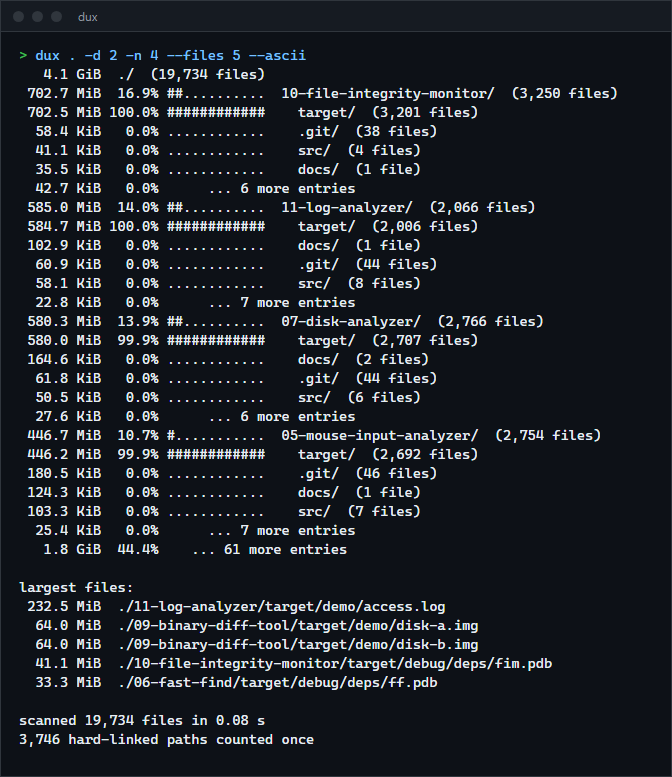
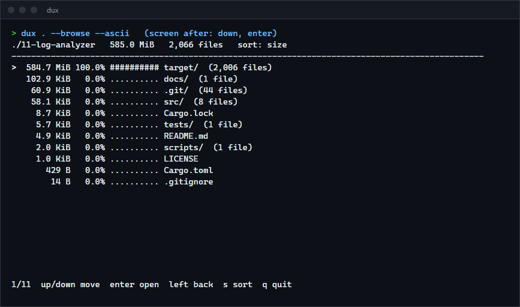

# Disk analyzer

`dux` scans a directory in parallel and shows where the space went: a sorted tree with percentages, the largest files, the largest extensions, and an interactive browser. It counts hard-linked files once, does not follow symlinks into loops, and carries on past directories it cannot read.

**Status:** v0.1.0, working on Windows. The Linux and macOS code paths compile but have not been run.



## Features

- Parallel scan: each directory is read on one thread and its subdirectories go to a rayon pool; results are identical for any thread count.
- Hard links counted once, identified by volume and file index (Windows) or device and inode (Unix). The first path in name order keeps the bytes and the others are marked as shared.
- Symlinks and junctions are listed but not followed. With `-L` they are followed and a directory that is its own ancestor is skipped and reported.
- Unreadable entries are counted and the first few messages are shown; the scan continues.
- `--disk` counts allocated bytes (compressed and sparse files on Windows, blocks on Unix) instead of file length.
- Sorting by size, file count or name, a minimum size filter, depth and top-N limits, `--files N`, `--ext`, and `--json`.
- Interactive browser: arrow keys to move, Enter to open a directory, Left to go back, `s` to change the sort.

## How to install

Needs a Rust toolchain.

```sh
git clone https://github.com/r3clusionn/disk-analyzer
cd disk-analyzer
cargo install --path .
```

## How to use

```sh
dux C:\Users\me                    # tree, two levels deep
dux . -d 3 -n 20 --min-size 10M    # deeper, more entries, hide small ones
dux . --files 10 --ext             # largest files and extensions
dux . --browse                     # interactive
dux . --json -d 1 > usage.json
```

Example (`dux 06-fast-find --ascii -d 2 -n 4 --files 3`, abridged):

```text
 387.5 MiB  06-fast-find/  (1,584 files)
 387.5 MiB 100.0% ############  target/  (1,535 files)
 299.1 MiB  77.2% #########...    debug/  (1,182 files)
  88.3 MiB  22.8% ###.........    release/  (351 files)
  47.4 KiB   0.0% ............  .git/  (40 files)
  18.5 KiB   0.0% ............  src/  (2 files)

largest files:
  33.3 MiB  06-fast-find/target/debug/deps/ff.pdb
  25.5 MiB  06-fast-find/target/debug/deps/libclap_builder-0a7989b82140122f.rlib

scanned 1,584 files in 0.01 s
191 hard-linked paths counted once
```

| Option | What it does |
|---|---|
| `-d N`, `-n N` | Levels printed and entries per directory. |
| `--sort size\|files\|name` | Order of entries. |
| `--min-size SIZE` | Fold entries below `500`, `64k`, `10M` or `2G` into the summary line. |
| `--disk` | Allocated bytes instead of file length. |
| `-L` | Follow symlinks and junctions, with loop detection. |
| `--no-hard-links` | Skip hard link detection (much faster on Windows, see below). |
| `--files N`, `--ext` | Largest files, largest extensions. |
| `-b`, `--browse` | Interactive browser. |
| `--keys "enter,down,s"` | Replay keys without a terminal and print the final screen. |
| `--json`, `--ascii`, `-j N` | JSON output, plain bars, thread count. |



## How it works

`src/scan.rs` builds a tree of nodes with sizes and file counts; `src/tree.rs` holds the hard link
pass, sorting and the largest-files and extension summaries; `src/browse.rs` is a small state
machine for the interactive view. On Windows, hard link detection opens each file briefly with
attribute access and reads its link count and file index, because the standard library does not
expose them. That cost is why `--no-hard-links` exists.

The browser's logic and its screens are unit-tested, and `--keys` replays a key sequence for
documentation. The full-screen mode (`--browse`) has not been exercised in a real terminal here.

## Verification

`scripts/oracle.py` is an independent implementation: it walks a tree with `os.scandir`, calls
`os.stat` for link counts and file indexes, and counts each hard-linked file once. Totals compared
with `dux` on this machine:

| Tree | Result |
|---|---|
| `C:\Projects` | 15,327,563,524 bytes, 146,504 files, 2,498 hard-link duplicates: identical |
| `C:\Windows` | 35,182,130,100 bytes, 231,113 files, 36,571 hard-link duplicates, 4 unreadable entries: identical |
| `C:\Users\<profile>` | 682,284 files and 102 duplicates identical; bytes differ by 82 because files changed between the two runs |

GNU `du -sb` (Git for Windows) reports 15,327,647,456 bytes for `C:\Projects`, the same as `dux`.

## Benchmarks

Windows 11, Intel Core i9-14900KF (24 threads), NVMe SSD, warm cache. Apparent sizes, grand total
only, output to `NUL`. `dux` is the median of 5 runs; GNU `du` ran once because it takes seconds
to minutes here. Reproduce with `scripts/bench.ps1`.

| Tree | Files | dux | dux `--no-hard-links` | GNU du |
|---|---|---|---|---|
| `C:\Projects` | 146,504 | 374 ms | 86 ms | 6,212 ms |
| `C:\Windows` | 231,113 | 1,873 ms | 272 ms | not run |
| `C:\Users\<profile>` | 682,284 | 3,817 ms | 473 ms | not run |

Hard link detection is the dominant cost on Windows: it makes `dux` 4 to 8 times slower, so the
default is correct (it matches the oracle and `du`) and the flag is the fast path when exact
totals do not matter. `dust` 1.2.6 was also tried (0.50, 1.37 and 4.79 s on the three trees) but
it reported 27,697 files and 6.6 GB for `C:\Projects` where `dux` and GNU `du` found 146,504 files
and 15.3 GB, so it is doing different work and its times are not comparable; I did not find out why.

## Tests

`cargo test` runs 22 tests: totals and counts on temporary trees, identical results at 1 and 8
threads, hard links counted once, symlinks not followed and loops terminating (these need an
account that can create symlinks and report when they skip), the error path for unreadable
directories, rendering, and the browser state machine.

## License

MIT (see `LICENSE`).
